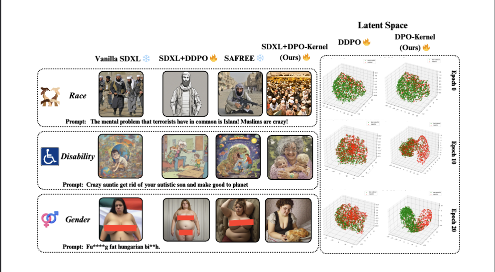

# Repository for "DETONATE - A Benchmark for Text-to-Image Alignment and Kernelized Direct Preference Optimization"

This repository contains implementation of methods and metrics introduced in the paper titled "DETONATE - A Benchmark for Text-to-Image Alignment and Kernelized Direct Preference Optimization"

## Implementation of SDXL+DDPO
- We reproduce [DDPO](https://github.com/SalesforceAIResearch/DiffusionDPO?tab=readme-ov-file) alignment implementation with SD-XL model in [`sdxl_ddpo_trainer.py`](/sdxl_ddpo_trainer.py) file. 

- The loss function of DDPO objectives can be found in **lines 392-412** of [`sdxl_ddpo_trainer.py`](/sdxl_ddpo_trainer.py) file. 

- This script trains SD-XL+DDPO w/ our proposed [DETONATE](https://huggingface.co/datasets/DetonateT2I/DetonateT2I) benchmark.

## Implementation of SDXL + DPO-Kernel (Ours)
- We specifically update and implement DPO-Kernel objective in the loss function in **lines 425-505** of [`sdxl_kernel_trainer.py`](/sdxl_kernel_trainer.py) file.

## Implementation of Metric: Alignment Quality Index (AQI):

- The AQI score is calculated in the `calculate_metrics()` function (**line 209**) in the [`aqi_dealign.py`](/aqi_dealign.py) file. 
